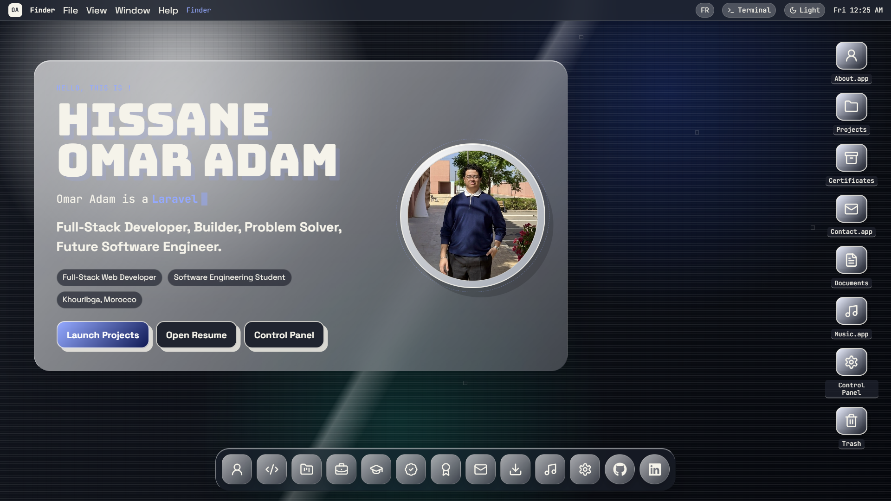

# 🍎 HISSANE OS

> A retro Macintosh-inspired portfolio built to showcase projects, skills, achievements, certifications, and the journey of a Full-Stack Developer.



## Overview

HISSANE OS is not a traditional portfolio website.

It is an interactive desktop experience inspired by classic Macintosh operating systems and modern Apple design principles. Visitors can navigate through draggable windows, a functional dock, desktop applications, and immersive interactions to discover projects, certifications, achievements, education, and professional experience.

The goal is to combine creativity, engineering, storytelling, and technical skills into a memorable experience.

---

## Features

* 🖥️ Interactive Macintosh-inspired desktop
* 🪟 Draggable windows
* 📌 Window minimize, maximize, and restore system
* 🚀 Animated startup experience
* 🍏 Functional macOS-style dock
* ⌨️ Interactive terminal
* 🏆 Certification gallery
* 📁 Project explorer
* 📄 Resume viewer
* 🎨 Liquid glass and retro UI effects
* ⚡ Performance-optimized animations
* 📱 Fully responsive design

---

## Built With

### Frontend

* React
* TypeScript
* Tailwind CSS
* Framer Motion

### Backend

* Laravel
* PHP
* REST APIs

### Database

* MySQL
* MongoDB

### Tools

* Git
* GitHub
* Docker
* Postman
* VS Code

---

## Deployment Environment

This project uses Vite, so frontend environment variables must start with `VITE_`.

Create `.env` locally from `.env.example`:

```bash
VITE_CONTACT_ENDPOINT=https://your-contact-endpoint.example/api/contact
```

For production, add the same variable in your hosting provider dashboard before building:

```bash
VITE_CONTACT_ENDPOINT=https://your-real-contact-endpoint
```

Do not commit `.env`. It is intentionally ignored. If the variable is missing, Contact.app falls back to opening the visitor's email app.

---

## Portfolio Sections

### About

Learn more about my background, goals, and development journey.

### Skills

Explore my technical stack, tools, and technologies.

### Projects

Showcasing real-world applications and development work.

### Experience

Professional and internship experiences.

### Education

Academic background and ongoing studies.

### Certifications

Verified certifications from MongoDB, DataCamp, Cisco, and more.

### Achievements

Competitions, hackathons, awards, and milestones.

### Contact

Ways to connect, collaborate, and get in touch.

---

## Featured Projects

### UniBuddy

A student collaboration platform built with Laravel, React, and MySQL.

### CoBIM Cloud

A BIM-focused cloud platform developed using Laravel, React, and Three.js.

### HISSANE OS

This portfolio itself — a fully interactive desktop experience.

---

## Philosophy

Most portfolios tell you what someone knows.

HISSANE OS is designed to demonstrate how I think, build, solve problems, and create experiences.

Every interaction, animation, and design decision reflects my passion for software engineering, full-stack development, and continuous learning.

---

## Connect With Me

🌐 Portfolio
https://hissaneomaradam.dev

💻 GitHub
https://github.com/hissaneomaradam

🔗 LinkedIn
https://linkedin.com/in/hissaneomaradam

📧 Email
[omaradamhissane@gmail.com](mailto:omaradamhissane@gmail.com)

---

Built with passion, curiosity, and countless hours of development by **HISSANE Omar Adam**.
